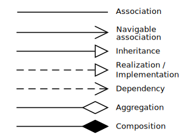

<!-- File: fundamentals_of_computation/software_engineering/uml_relationships.md -->

# UML Relationships

Unified Modeling Language (UML) relationships define how classes and other elements interact in object-oriented design.

## Types of Relationships

### 1. Association
A basic relationship between classes that establishes a semantic connection.

### 2. Aggregation
Represents a "whole-part" relationship where the part can exist independently of the whole.

  

### 3. Composition
A stronger form of aggregation where the part cannot exist independently of the whole.

  

### 4. Inheritance (Generalization)
Represents an "is-a" relationship where a subclass inherits attributes and behavior from a superclass.

### 5. Realization
Indicates that a class implements the behavior defined by an interface.

### 6. Dependency
A weaker relationship where a change in one class may affect another, but without strong ownership.

---

**References:**
- [UML Relationships – Wikipedia](https://en.wikipedia.org/wiki/Class_diagram)
