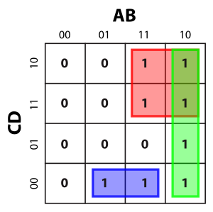

<!-- File: discrete_math/karnaugh_maps.md -->

# Karnaugh Maps

---

## Purpose

Karnaugh maps simplify Boolean expressions by grouping adjacent 1s to minimize variables.

---

## How to Use

- Fill the K-map with 1s and 0s from the truth table.
- Group adjacent 1s in rectangles of size \(2^n\) (1, 2, 4, 8, ...).
- Groups can wrap around edges.
- Each group corresponds to a product (AND) term.
- Combine groups using OR to get the simplified sum-of-products.

---

## Example Map

---

## Tips

- Make groups as large as possible.
- Overlapping groups are allowed.
- Single 1s represent minterms.
- Use groups to eliminate variables that change within group.

---

## Quick Summary

1. Populate map from truth table.  
2. Identify largest possible groups of 1s.  
3. Write product terms from groups.  
4. Sum terms for minimal expression.

---

