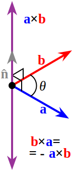

<!-- File: linear_algebra/cross_product.md -->

# Cross Product in Three Dimensions

---

## Definition

The cross product of two vectors **a** = (a₁, a₂, a₃) and **b** = (b₁, b₂, b₃) in three-dimensional space is a vector **a × b** that is orthogonal to both **a** and **b**.

The cross product is defined as:

$$
\mathbf{u} \times \mathbf{b} = 
\begin{vmatrix}
\mathbf{i} & \mathbf{j} & \mathbf{k} \\
a_1 & a_2 & a_3 \\
b_1 & b_2 & b_3
\end{vmatrix}
= 
\left(
a_2 b_3 - a_3 b_2,\,
a_3 b_1 - a_1 b_3,\,
a_1 b_2 - a_2 b_1
\right)
$$

---

---

## Properties

- The resulting vector is orthogonal to both **u** and **b**.  
- The magnitude of the cross product equals the area of the parallelogram spanned by **a** and **b**.  
- The cross product is anti-commutative, meaning that swapping the vectors changes the sign:  
  **a × b = –(b × a)**.

---

## Example

Given vectors **a** = (1, 2, 3) and **b** = (4, 5, 6):

$$
\mathbf{a} \times \mathbf{b} = 
\left(
2 \times 6 - 3 \times 5,\,
3 \times 4 - 1 \times 6,\,
1 \times 5 - 2 \times 4
\right) = (-3, 6, -3)
$$

---
