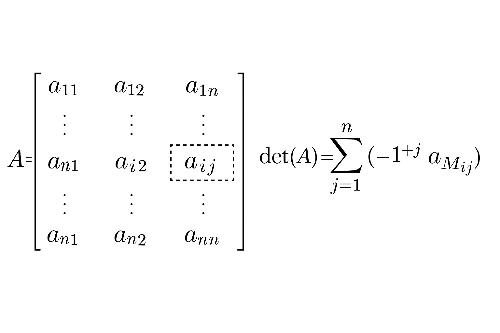

<!-- File: linear_algebra/determinants.md -->

# Determinants

📺 [3Blue1Brown – Visual Intuition on Determinants](https://www.youtube.com/watch?v=Ip3X9LOh2dk&ab_channel=3Blue1Brown)

---

## Rule of Sarrus

  

**Rule of Sarrus:** The determinant of a $3 \times 3$ matrix is computed by summing the products of the down-right diagonals and subtracting the products of the up-right diagonals.

---

## Cofactor Expansion

  

**Cofactor Expansion (Laplace’s Formula):** The determinant of an $n \times n$ matrix $A = [a_{ij}]$ can be computed by expanding along any row or column.

For expansion along row $i$:

$$
\det(A) = \sum_{j=1}^{n} (-1)^{i+j} a_{ij} \det(M_{ij})
$$

where:

- $M_{ij}$ is the $(n-1) \times (n-1)$ minor obtained by deleting row $i$ and column $j$.
- $(-1)^{i+j}$ is the sign factor (checkerboard pattern of $+$ and $-$).

---

### Example (Expansion Along Row 1)

For
$$
A = \begin{pmatrix}
a & b & c \\
d & e & f \\
g & h & i
\end{pmatrix}
$$

the determinant is:

$$
\det(A) = a\begin{vmatrix} e & f \\ h & i \end{vmatrix}
- b\begin{vmatrix} d & f \\ g & i \end{vmatrix}
+ c\begin{vmatrix} d & e \\ g & h \end{vmatrix}
$$

That is:

$$
\det(A) = a(ei - fh) - b(di - fg) + c(dh - eg)
$$

---

<!-- TODO: Add intuition and formal properties of determinants -->
