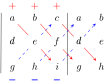

# Determinants

📺 [3Blue1Brown – Visual Intuition on Determinants](https://www.youtube.com/watch?v=Ip3X9LOh2dk&ab_channel=3Blue1Brown)

## Rule of Sarrus

**Rule of Sarrus:** The determinant of the three columns on the left is the sum of the products along the down-right diagonals minus the sum of the products along the up-right diagonals.

<!-- TODO: Add intuition and formal properties of determinants -->
