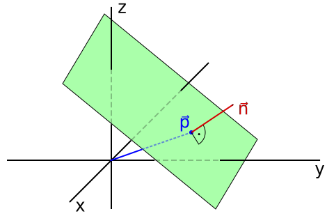

<!-- File: linear_algebra/planes.md -->

# Planes in Three-Dimensional Space

---

## Normal Vector Relation

The coefficients a, b, c in the plane equation

$$
ax + by + cz + d = 0
$$

define a vector **n** = (a, b, c) that is orthogonal (normal) to the plane.

---

---
